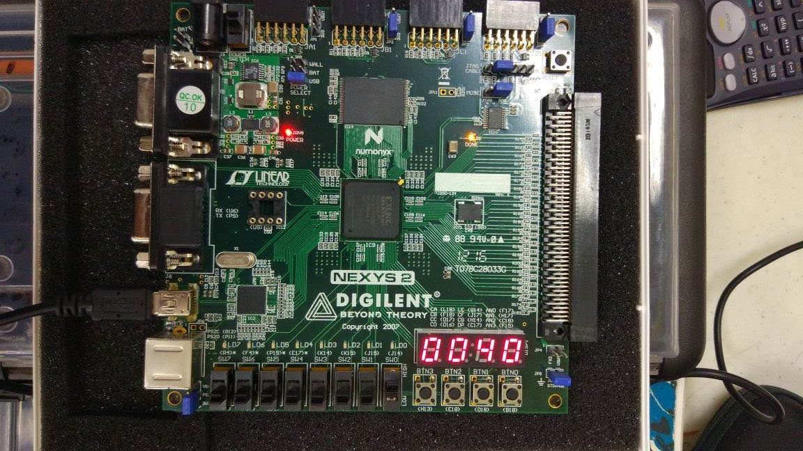

> **Aviso:** Este post fue migrado desde mi blog viejo de mis tiempos de universitario. Cabe
> resaltar que, por solicitud del profesor que impartió la clase, el código aquí mostrado
> tiene fallos intencionales.

En ésta ocasión elaboramos un contador capaz de contar del 0 al 9999 y mostrar la cuenta en los displays.
El contador tiene un botón para contar en adición, otro para contar en regresión y uno más para reiniciar
el conteo a cero. Se utilizó el lenguaje VHDL para descripción de circuitos digitales.



Para el proyecto se implementó el siguiente código:

```
library IEEE;
use IEEE.STD_LOGIC_UNSIGNED.ALL;
use IEEE.STD_LOGIC_ARITH.ALL;
use IEEE.STD_LOGIC_1164.ALL;

use IEEE.NUMERIC_STD.ALL;

entity contador is
port (
clk: in std_logic;
btnUp: in std_logic;
btnDown: in std_logic;
btnReset: in std_logic;
vrgzaUp: in std_logic;
vrgzaDown: in std_logic;
an: out std_logic_vector(3 downto 0);
seg: out std_logic_vector(6 downto 0);
dp: out std_logic
);
end contador;

architecture Behavioral of contador is
type estados is (sumar,neutral,restar);
signal pre,fut: estados;

signal mult: std_logic_vector(1 downto 0):="00";

signal N: std_logic_vector (3 downto 0):="0000";
signal a: std_logic_vector(3 downto 0):="0000";
signal b: std_logic_vector(3 downto 0):="0000";
signal c: std_logic_vector(3 downto 0):="0000";
signal d: std_logic_vector(3 downto 0):="0000";
signal pulsoDisp: std_logic;
signal pulsoVrgza: std_logic;
signal contador1: integer range 0 to 100000 := 0;

begin
dp<='1';
 with N select
 seg<="0000001" when "0000",
    "1001111" when "0001",
    "0010010" when "0010",
    "0000110" when "0011",
    "1001100" when "0100",
    "0100000" when "0110",
    "0001111" when "0111",
    "0000000" when "1000",
    "0000100" when "1001",
  "1111111" when others;

  
 divisorFrecuencia: process (clk)
 begin
 if rising_edge(clk) then
  if contador1=100000 then
   pulsoDisp <= not pulsoDisp;
   contador1<=0;
  else
   contador1<=contador1 + 1;
  end if; 
  
 end if;
 end process divisorFrecuencia;

 
 pro1: process (pulsoDisp)
 variable control: std_logic:='0';
 variable contint: integer range 0 to 10;
 begin
 if rising_edge(plusoDisp) then
 contint:= contint+1;
 if contint=10 then
  if (vrgzaUp='0' and vrgzaDown='0') then
   a<=a;
 elsif (vrgzaUp='0' and vrgzaDown='1') then
  a<=a-1;
  if a="0000" then
   a<="1001";
   b<=b-1;
   if b="0000" then
    b<="1001";
    c<=c-1;
    if c="0000" then
     c<="1001";
     d<=d-1;
     if d="0000" then
      d<="1001";
     end if;
    end if;
   end if;
  end if;
 elsif (vrgzaUp='1' and vrgzaDown='0') then
  a<=a+1;
  if a="1001" then
   a<="0000";
   if b="1001" then
    b<="0000";
    c<=c+1;
    if c="1001" then
     c<="0000";
     d<=d+1;
     if d="1001" then
      d<="0000";
     end if;
    end if;
   end if;
  end if;
 elsif (vrgzaUp='1' and vrgzaDown='1') then
  a<=a;
 end if;
 
 end if;
 mult<= mult+1;
  if (btnUp='0' and btnDown='0') then
    if btnReset='1' then
    a<="0000";
    b<="0000";
    c<="0000";
    d<="0000";
   end if;
  control:='0';
 elsif (btnUp='0' and btnDown='1') then
  if control='0' then
  a<=a-1;
  if a="0000" then
   a<="1001";
   b<=b-1;
   if b="0000" then
    b<="1001";
    c<=c-1;
    if c="0000" then
     c<="1001";
     d<=d-1;
     if d="0000" then
      d<="1001";
     end if;
    end if;
   end if;
  end if;
  end if;
  control:='0';
 elsif (btnUp='1' and btnDown='0') then
  if control='0' then
  a<=a+1;
  if a="1001" then
   a<="0000";
   b<=b+1;
   if b="1001" then
    b<="0000";
    c<=c+1;
    if c="1001" then
     c<="0000";
     d<=d+1;
     if d="1001" then
      d<="0000";
     end if;
    end if;
   end if;
  end if;
  end if;
  control:='1';
 elsif (btnUp='1' and btnDown='1') then
  a<=a;
 end if;
 end process pro1;
 
 pro2: process (mult)
 begin
 if mult="00" then
   N<=a;
   an<="0001";
  elsif mult="01" then
   Na<=b;
   an<="0010";
  elsif mult="10" then
   Nb<=c;
   an<="0100";
  elsif mult="11" then
   Nc<=d;
   an<="1000";
  end if;
 end process pro2;

end Behavioral;
```

El código tiene un control de rebote para los botones. También se integraron interruptores con la
función de realizar un conteo continuo.

Para el mapeo de entradas y salidas se utilizó el siguiente código UCF. El código contiene el nombre
la ubicación fija de todas las entradas y salidas, de ésta manera asociamos físicamente los pines.

```
NET "clk"   LOC = "B8"; # Bank = 0, Pin name = IP_L13P_0/GCLK8, Type = GCLK, Sch name = GCLK0

NET "seg<6>" LOC = "L18"; # Bank = 1, Pin name = IO_L10P_1, Type = I/O, Sch name = CA
NET "seg<5>" LOC = "F18"; # Bank = 1, Pin name = IO_L19P_1, Type = I/O, Sch name = CB
NET "seg<4>" LOC = "D17"; # Bank = 1, Pin name = IO_L23P_1/HDC, Type = DUAL, Sch name = CC
NET "seg<2>" LOC = "G14"; # Bank = 1, Pin name = IO_L20P_1, Type = I/O, Sch name = CE
NET "seg<1>" LOC = "J17"; # Bank = 1, Pin name = IO_L13P_1/A6/RHCLK4/IRDY1, Type = RHCLK/DUAL, Sch name = CF
NET "seg<0>" LOC = "H14"; # Bank = 1, Pin name = IO_L17P_1, Type = I/O, Sch name = CG
NET "dp"     LOC = "C17"; # Bank = 1, Pin name = IO_L24N_1/LDC2, Type = DUAL, Sch name = DP

NET "an<0>" LOC = "F17"; # Bank = 1, Pin name = IO_L19N_1, Type = I/O, Sch name = AN0
NET "an<1>" LOC = "H17"; # Bank = 1, Pin name = IO_L16N_1/A0, Type = DUAL, Sch name = AN1
NET "an<2>" LOC = "C18"; # Bank = 1, Pin name = IO_L24P_1/LDC1, Type = DUAL, Sch name = AN2
NET "an<3>" LOC = "F15"; # Bank = 1, Pin name = IO_L21P_1, Type = I/O, Sch name = AN3

NET "btnUp" LOC = "B18"; # Bank = 1, Pin name = IP, Type = INPUT, Sch name = BTN0
NET "btnDown" LOC = "D18"; # Bank = 1, Pin name = IP/VREF_1, Type = VREF, Sch name = BTN1
NET "btnReset" LOC = "E18"; # Bank = 1, Pin name = IP, Type = INPUT, Sch name = BTN2

NET "vrgzaUp" LOC = "G18"; # Bank = 1, Pin name = IP, Type = INPUT, Sch name = SW0
NET "vrgzaDown" LOC = "H18"; # Bank = 1, Pin name = IP/VREF_1, Type = VREF, Sch name = SW1
```

El resultado final es el siguiente:

<iframe width="100%" style="aspect-ratio: 16/9" src="https://www.youtube.com/embed/KJdwcr9cX8U" title="Contador con FPGA Spartan 3E y Nexys 2" frameborder="0" allow="accelerometer; autoplay; clipboard-write; encrypted-media; gyroscope; picture-in-picture; web-share" referrerpolicy="strict-origin-when-cross-origin" allowfullscreen></iframe>
