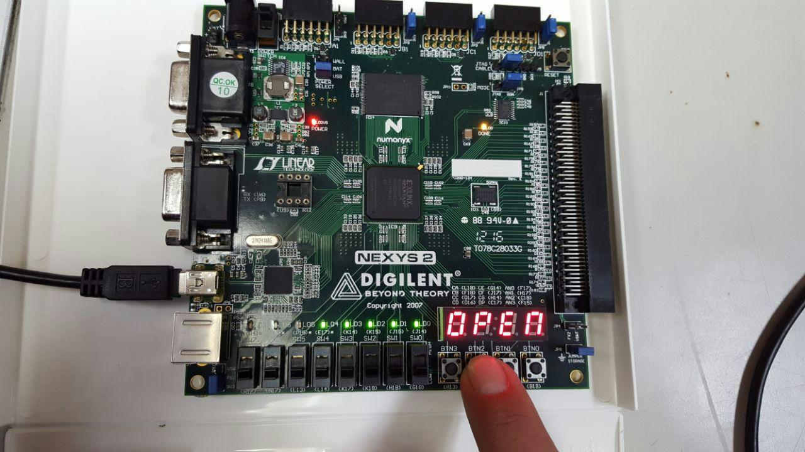

> **Aviso:** Este post fue migrado desde mi blog viejo de mis tiempos de universitario. Cabe
> resaltar que, por solicitud del profesor que impartió la clase, el código aquí mostrado
> tiene fallos intencionales.

Control de acceso con contraseña, utilizando FPGA Spartan 3E y Nexys 2



<iframe width="100%" style="aspect-ratio: 16/9" src="https://www.youtube.com/embed/PphPUbadG80" title="Contraseña Programable con FPGA Spartan 3E y Nexys 2" frameborder="0" allow="accelerometer; autoplay; clipboard-write; encrypted-media; gyroscope; picture-in-picture; web-share" referrerpolicy="strict-origin-when-cross-origin" allowfullscreen></iframe>

## Código

```
library IEEE;
use IEEE.STD_LOGIC_UNSIGNED.ALL;
use IEEE.STD_LOGIC_ARITH.ALL;
use IEEE.STD_LOGIC_1164.ALL;

use IEEE.NUMERIC_STD.ALL;

entity contador is
port (
clk: in std_logic;
btnUp: in std_logic;
btnDown: in std_logic;
btnReset: in std_logic;
vrgzaUp: in std_logic;
vrgzaDown: in std_logic;
an: out std_logic_vector(3 downto 0);
seg: out std_logic_vector(6 downto 0);
dp: out std_logic
);
end contador;

architecture Behavioral of contador is
type estados is (sumar,neutral,restar);
signal pre,fut: estados;

signal mult: std_logic_vector(1 downto 0):="00";

signal N: std_logic_vector (3 downto 0):="0000";
signal a: std_logic_vector(3 downto 0):="0000";
signal b: std_logic_vector(3 downto 0):="0000";
signal c: std_logic_vector(3 downto 0):="0000";
signal d: std_logic_vector(3 downto 0):="0000";
signal pulsoDisp: std_logic;
signal pulsoVrgza: std_logic;
signal contador1: integer range 0 to 100000 := 0;

begin
dp<='1';
 with N select
 seg<="0000001" when "0000",
    "1001111" when "0001",
    "0010010" when "0010",
    "0000110" when "0011",
    "1001100" when "0100",
    "0100000" when "0110",
    "0001111" when "0111",
    "0000000" when "1000",
    "0000100" when "1001",
  "1111111" when others;

  
 divisorFrecuencia: process (clk)
 begin
 if rising_edge(clk) then
  if contador1=100000 then
   pulsoDisp <= not pulsoDisp;
   contador1<=0;
  else
   contador1<=contador1 + 1;
  end if; 
  
 end if;
 end process divisorFrecuencia;

 
 pro1: process (pulsoDisp)
 variable control: std_logic:='0';
 variable contint: integer range 0 to 10;
 begin
 if rising_edge(plusoDisp) then
 contint:= contint+1;
 if contint=10 then
  if (vrgzaUp='0' and vrgzaDown='0') then
   a<=a;
 elsif (vrgzaUp='0' and vrgzaDown='1') then
 
  end if;
 end process pro2;

end Behavioral;
```


