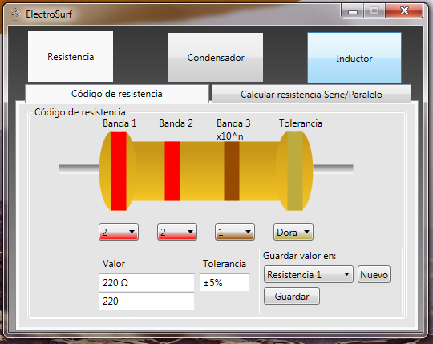

> **Aviso:** Este post fue migrado desde mi blog viejo de mis tiempos de universitario.

# ElectroSurf: Software para cálculo de resistencias, capacitancia e inductancia

El siguiente software fue un pequeño proyecto de la universidad de hace un par de años.
Puedes calcular el valor de la resistencia usando el código de colores y guardar el valor de
dicha resistencia para posteriormente calcular un circuito en serie o en paralelo con resistencias.
También calcula los condensadores en circuitos serie o paralelo y puede calcular la inductancia
de una bobina.

El programa está escrito en C#.Cuenta con una pequeña clase que contiene los atributos de cada uno
de los elementos a calcular (resistencia, condensador e inductor) y los métodos necesarios para
convertir el código de colores al valor resistivo y para el cálculo de circuitos en serie y paralelo.

El código fuente se encuentra disponible en Github:

<https://github.com/danyael031/ElectroSurf>
